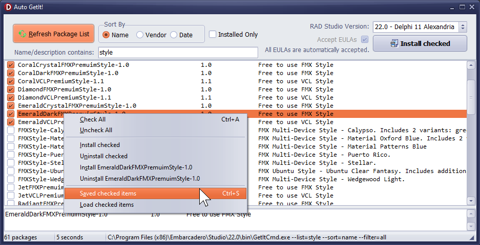

# AutoGetIt

The idea with this small Delphi program is to automate the [GetIt package manager](http://docwiki.embarcadero.com/RADStudio/en/Installing_a_Package_Using_GetIt_Package_Manager) for RAD Studio (Delphi) by calling the GetIt command-line tool that comes with Delphi.  Every time there's an update or a need to reinstall, it's a pain to tediously and manually go through all the GetIt packages and reinstall them. Wouldn't it be nice if there was a saved checklist?

Now there is!

This Delphi program uses the DosCommand component (available on GetIt) to shell out to the GetItCmd.exe and show all the packages in a CheckListBox. You then simply check off all the packages you want to install, click the Install button, and sit back and watch them all get installed (some require authorization so it's not completely unattended). You can also right+click on this list to select all or none, or uninstall the checked packages instead, or install/uninstall just one package at a time.

_Originally Written in Delphi 10.4.1, tested on the update to Delphi 10.4.2: installed over 75 packages in less than 30 minutes!_

## Delphi 13 ##

AutoGetIt supports Delphi 13 Florence (GetIt 7.0). Earlier versions of AutoGetIt could show a short or garbled package list there: the cause was partial output lines being parsed as whole ones, not GetItCmd's redirected output, and it is fixed.

## Build ##

This code, as stated above, was originally written in Delphi 10.4 Sydney; it was upgraded to Delphi 11 Alexandria and now is maintained in Delphi 12 Athens. It uses an [ImageCollection](http://docwiki.embarcadero.com/RADStudio/Athens/en/Supporting_high-DPI_images_with_the_Image_Collection_and_Virtual_ImageList_components) componet which was introduced in Delphi 10.3 Rio, so is not compatible with versions of Delphi before that. However, the compiled application is available here (click on [Releases](https://github.com/corneliusdavid/AutoGetIt/releases)) which supports the GetIt command-line tool back to Delphi 10.2 Tokyo.

The only add-on package needed to compile this code is the [DOSCommand](https://github.com/TurboPack/DOSCommand) library, available either on GitHub or on GetIt.

## Batch files

If you don't want to run the GUI, I also wrote a bunch of batch files that do the same thing but with pre-selected groups of packages.  I basically dumped all the packages into a text file then prepended the GetIt command line to install them and separated them into variously grouped batch files, some duplicated among a couple of groups. If you haven't already done this for your install, this will help get you started.

To run the batch files, start a DOS Prompt as Administrator, run the `rsvars.bat` batch file from your Delphi folder, then run any of the batch files in the `batch`  folder. You will want to modify the batch files and comment out the packages you don't want.

_NOTE: The package names in these batch files come from the GetIt catalogues of Delphi 10.4 to 12. GetIt 7.0 (Delphi 13 Florence) renamed its packages, to bare names or a `-13` suffix such as `SynEdit-13`, and the Winsoft 2020 packages are no longer in it, so on Delphi 13 these batch files will not find the packages. To make a batch file for Delphi 13, list the packages with `GetItCmd --list= --filter=all` (or use AutoGetIt and save a checked list) and use the names it shows._

## Links

- [Enabling GetIt Install Logs](https://blog.marcocantu.com/blog/2018-july-getit-install-logs.html)
- [Delphi 10.4.2 Release Notes](http://docwiki.embarcadero.com/RADStudio/Sydney/en/Release_Notes)
- [Delphi 11 Release Notes](https://docwiki.embarcadero.com/RADStudio/Alexandria/en/Release_Notes)
- [Delphi 12 Release Notes](https://docwiki.embarcadero.com/RADStudio/Athens/en/Release_Notes)
- [Delphi 13 Release Notes](https://docwiki.embarcadero.com/RADStudio/Florence/en/Release_Notes)

## Screenshot

