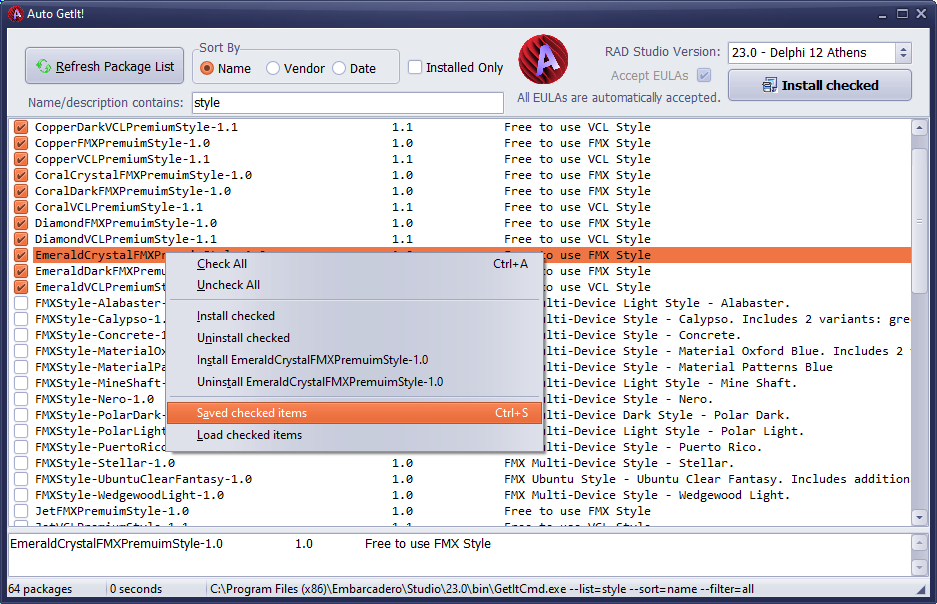

# AutoGetIt
The idea with this small Delphi program is to automate the [GetIt package manager](http://docwiki.embarcadero.com/RADStudio/Sydney/en/Installing_a_Package_Using_GetIt_Package_Manager) for RAD Studio (Delphi) by calling the GetIt command-line tool that comes with Delphi.  Every time there's an update or a need to reinstall, it's a pain to tediously and manually go through all the GetIt packages you may want and reinstall them all. This can be done on the command-line but the documentation for GetIt is weak.

This Delphi program uses the DosCommand component (available on GetIt) to shell out to the GetItCmd.exe and show all the packages in a CheckListBox. You then simply check off all the packages you want to install, click the Install Selected from the pop-up menu, and sit back and watch them all get installed!

_Written in Delphi 10.4.1;  Tested on the update to Delphi 10.4.2_

## Planned updates

The program has two features not yet implemented:

- Uninstall: I have not yet implemented uninstalling GetIt packages.
- Saving the list: For automation without needing to use batch files, the list of packages selected to be installed will be saved for later recall.

## Batch files

If you don't want to run the GUI, I also wrote a bunch of batch files that do the same thing but with pre-selected groups of packages.  I basically dumped all the packages into a text file then prepended the GetIt command line to install them and separated them into variously grouped batch files, some duplicated among a couple of groups. If you haven't already done this for your install, this will help get you started.

To run the batch files, start a DOS Prompt as Administrator, run the `rsvars.bat` batch file from your Delphi folder, then run any of the batch files in the `batch`  folder. You will want to modify the batch files and comment out the packages you don't want.

